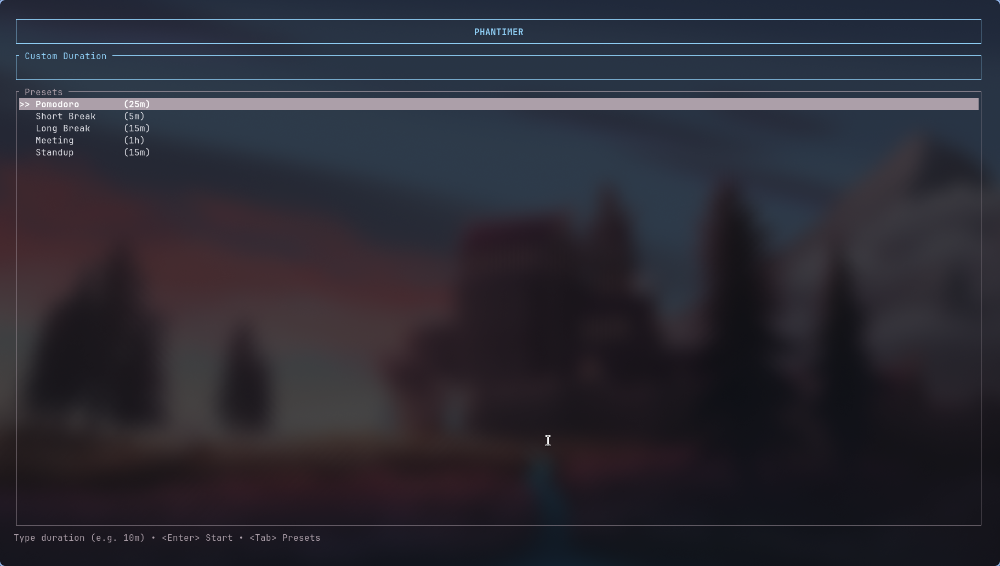

# 👻 Phantimer


**Phantimer** is a lightweight, "ghost" timer specifically designed for the [Hyprland](https://hyprland.org/) compositor. It spawns a floating, pinned, and unobtrusive timer window that stays out of your way while keeping you on track.

> _"It floats. It fades. It haunts your workflow... productively."_

---

## ✨ Features

- **👻 Ghost Mode:** Automatically floats, pins, and removes borders from the timer window.
- **📍 Smart Positioning:** Snaps perfectly to the top-right corner of your active monitor (using `monitor_w` logic).
- **🌫️ Interactive Opacity:** High visibility when active (90%), fades into the background when inactive (20%).
- **🐚 Terminal Agnostic:** Automatically detects your default `$TERMINAL` (defaults to `foot` if not set).
- **🦀 Blazingly Fast:** Written in pure Rust for instant startup.

---

## 📸 Preview




---

## 📦 Installation

### 🏹 Arch Linux (AUR)

The recommended installation method is via the AUR:

```bash
yay -S phantimer
# or
paru -S phantimer
```
