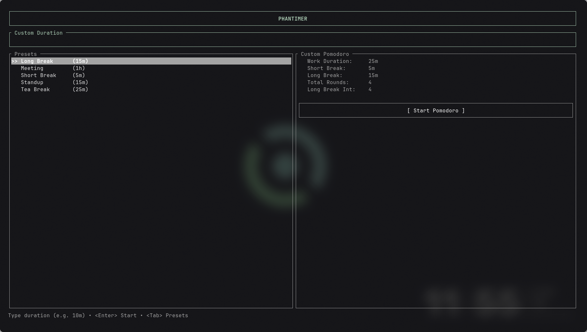
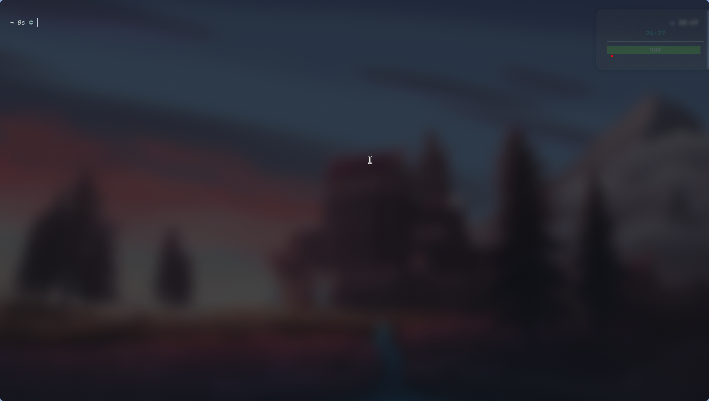

# 👻 Phantimer


**Phantimer** is a lightweight, "ghost" timer specifically designed for the [Hyprland](https://hyprland.org/) compositor. It spawns a floating, pinned, and unobtrusive timer window that stays out of your way while keeping you on track.

> _"It floats. It fades. It haunts your workflow... productively."_

---

## ✨ Features

- **👻 Ghost Mode:** Automatically floats, pins, and removes borders from the timer window.
- **🍅 Pomodoro Session Builder:** Fully custom Pomodoro set controller. Configure total rounds and long break frequency (e.g. every 2 or 3 rounds) directly from the dashboard or CLI.
- **📍 Smart Positioning:** Snaps perfectly to the top-right corner of your active monitor (using `monitor_w` logic).
- **🌫️ Interactive Opacity:** High visibility when active (90%), fades into the background when inactive (20%).
- **🔔 Desktop Notifications:** Sends non-blocking desktop alerts on session changes and countdown completion.
- **⚙️ TOML Configurable:** Customize default terminal emulators, presets list, colors, Pomodoro stage parameters, and Hyprland layout rules.
- **🐚 Terminal Agnostic:** Automatically detects default shell terminals (using `$TERMINAL` fallback).
- **🦀 Blazingly Fast:** Written in pure Rust for instant startup.

---

## 📸 Preview





---

## 📦 Installation

### 🏹 Arch Linux (AUR)

The recommended installation method is via the AUR:

```bash
yay -S phantimer
# or
paru -S phantimer
```

---

## ⚙️ Configuration

Phantimer can be fully customized using a TOML configuration file. The file should be placed at:
`~/.config/phantimer/config.toml` (or `$XDG_CONFIG_HOME/phantimer/config.toml`)

Here is a default `config.toml` example showing all available settings:

```toml
# Default terminal emulator if not specified by $TERMINAL
terminal = "foot"

# Custom presets shown in the TUI dashboard presets column
[presets]
"Tea Break" = "25m"
"Short Break" = "5m"
"Long Break" = "15m"
"Meeting" = "1h"
"Standup" = "15m"

# Default Pomodoro timings and round parameters
[pomodoro]
work = "25m"
short_break = "5m"
long_break = "15m"
rounds = 4
long_break_interval = 4

# Custom theme colors for the TUI countdown elements
# Accepts: Black, Red, Green, Yellow, Blue, Magenta, Cyan, Gray, DarkGray,
#          LightRed, LightGreen, LightYellow, LightBlue, LightMagenta, LightCyan, White
[colors]
timer_text = "Cyan"
work_session = "Red"
break_session = "Green"
paused_text = "Yellow"

# Custom Hyprland window rules to apply dynamically
[hyprland]
rules = [
    "match:class ^(floating-timer)$, size 300 150",
    "match:class ^(floating-timer)$, move (monitor_w-310) 50",
    "match:class ^(floating-timer)$, float true",
    "match:class ^(floating-timer)$, pin true",
    "match:class ^(floating-timer)$, noborder true",
    "match:class ^(floating-timer)$, opacity 0.9 0.2"
]
```

---

## ⌨️ Controls

While the active countdown window is running, the following keyboard controls are supported:

- `[Space]` — Pause / Resume the timer countdown.
- `[Shift+R]` — Reset the current countdown session back to its full starting duration (starts in a paused state).
- `[q]` or `[Esc]` — Quit and close the timer window immediately.
